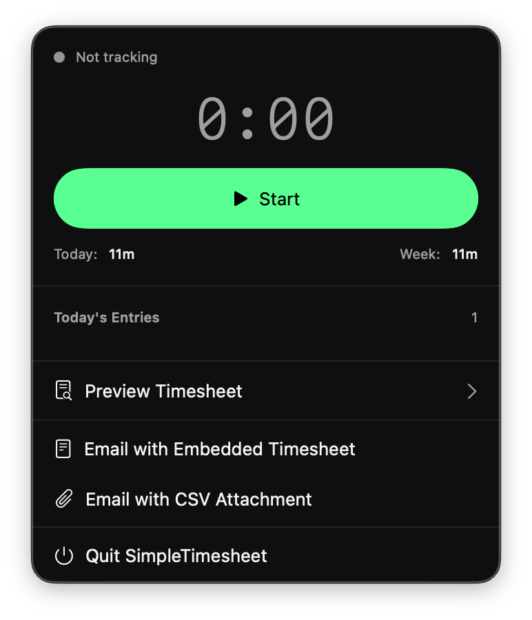
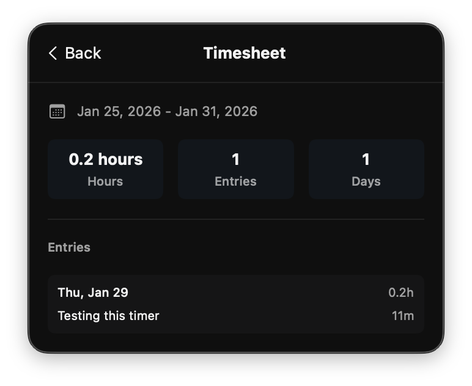

# SimpleTimesheet

[](https://github.com/gogrinimish/SimpleTimesheet/actions/workflows/build.yml)
[](https://opensource.org/licenses/MIT)
[](https://github.com/gogrinimish/SimpleTimesheet)

A local-first, cross-platform time tracking app for macOS, iOS, and Android (planned). Track your hours, generate timesheets, and email them to approvers — all without accounts, servers, or data lock-in.

**Learn more:** [SimpleTimesheet website](https://gogrinimish.github.io/SimpleTimesheet/)

## Screenshots

### macOS Menu Bar

| Menu bar popover | Menu bar icon (timer running) |
|------------------|--------------------------------|
|  |  |

### Timer

| Timer running | Timesheet preview |
|---------------|-------------------|
|  |  |

### Settings

| Folder & timezone | Email template | Send reminder |
|-------------------|-----------------|---------------|
|  |  |  |

### Email

| Embedded timesheet email draft |
|-------------------------------|
|  |

## Features

### Core Functionality
- **Quick Time Tracking**: Start and stop the clock with a single tap or click
- **Work Descriptions**: Add notes when you stop the clock to capture what you worked on
- **Timesheet Generation**: Automatically compile tracked time into clean, ready-to-send timesheets
- **Email Integration**: Generate emails to approvers with embedded timesheets or attachments
- **Cross-Device Sync**: Keep data in a shared folder (iCloud, Google Drive, OneDrive) for seamless multi-device sync

### Platform-Specific Features
- **macOS**: Menu bar access, keyboard shortcuts, and notifications
- **iOS**: Widgets, long-press actions, and notifications
- **Android**: PLANNED


## Installation

### Prerequisites

#### For Development
- macOS 15+ with Xcode 16+
- [Skip](https://skip.dev) for Android support

```bash
# Install Skip
brew install skiptools/skip/skip

# Verify installation
skip checkup
```

### Building from Source

1. Clone the repository:
```bash
git clone https://github.com/gogrinimish/SimpleTimesheet.git
cd SimpleTimesheet
```

2. Open in Xcode:
```bash
open SimpleTimesheet.xcodeproj
```

3. Build and run:
   - For macOS: Select `SimpleTimesheetMac` scheme
   - For iOS: Select `SimpleTimesheet` scheme
   - For Android: Select `SimpleTimesheet` scheme and choose Android device/emulator

### Pre-built Releases

Download the latest release from the [Releases](https://github.com/gogrinimish/SimpleTimesheet/releases) page.

> **Note:** The releases are unsigned. For macOS, you may need to right-click and select "Open" on first launch. For iOS, you'll need to sideload using AltStore, Sideloadly, or a similar tool.

## Configuration

All configuration is stored in JSON files within your chosen storage folder, enabling sync across devices:

```
YourTimesheetFolder/
├── config.json              # App configuration
├── timesheets/              # Generated timesheets (one file per period)
│   ├── 2026-01-<id>.json    # e.g. 2026-01-abc12345.json
│   └── ...
└── time-entries/            # Raw time entry data
    └── entries.json
```

### Configuration Options

| Setting | Description |
|---------|-------------|
| `storageFolder` | Path to the folder for storing timesheets |
| `timezone` | Timezone for timesheet calculations (e.g., "America/New_York") |
| `notificationTime` | Time to send reminder notification (e.g., "17:00") |
| `emailTemplate` | Custom email template for timesheet submissions (placeholders: `{{userName}}`, `{{periodStart}}`, `{{periodEnd}}`, `{{totalHours}}`, `{{entriesSummary}}`) |
| `approverEmail` | Email address of the timesheet approver |
| `notificationDays` | Days of week to send notifications (1=Sunday … 7=Saturday; e.g. [6] for Friday) |

## Usage

### macOS Menu Bar

1. Click the clock icon in the menu bar
2. Click "Start" to begin tracking
3. When finished, click "Stop" and enter a description
4. At the configured time, you'll receive a notification to send your timesheet
5. Click "Send Timesheet" to email it to your approver

### iOS/Android Widgets

1. Add the SimpleTimesheet widget to your home screen
2. Tap the play button to start tracking
3. Tap the stop button to stop and add a description
4. Use the app for configuration and viewing history

### Keyboard Shortcuts (macOS)

| Shortcut | Action |
|----------|--------|
| `⌘⇧S` | Start/Stop clock |
| `⌘⇧T` | Open timesheet |
| `⌘,` | Open preferences |

## Privacy


SimpleTimesheet is built from the ground up to be local-first and privacy-preserving:
- **Your data, your files**: All data is stored as files in a folder you control
- **No servers, no accounts**: The app works fully offline and never requires sign-ups
- **Bring your own sync**: Use iCloud, Google Drive, or OneDrive to sync across devices
- **No analytics, no tracking**: Nothing is collected, measured, or phoned home
- **Open source by design**: Inspect the code and see exactly how your data is handled

## Feedback & Bugs

Found a bug or have a suggestion? Please open an [issue](https://github.com/gogrinimish/SimpleTimesheet/issues). We use issues for:

- **Bug reports** – describe the problem, steps to reproduce, and your environment (OS, app version).
- **Feature requests** – describe the feature and how you’d use it.
- **General feedback** – ideas, UX improvements, or documentation fixes.

Check [existing issues](https://github.com/gogrinimish/SimpleTimesheet/issues) first to avoid duplicates.

## Collaborators Wanted

SimpleTimesheet is a solo project today. If you’d like to help shape the next set of features, we’re especially interested in collaborators for:

- **Android & Windows apps** – Extend the app to Android (e.g. via [Skip](https://skip.dev)) and Windows (e.g. Swift on Windows or a separate stack). Experience with cross-platform or native mobile/desktop is a plus.
- **Multiple projects / timesheets** – Design and implement support for multiple projects or timesheet “workspaces” (e.g. per client, per contract) with clear data model and UI.

If you’re interested, open an issue with the label `collaborator` or `good first project`, or comment on the relevant [roadmap issues](https://github.com/gogrinimish/SimpleTimesheet/issues).

## Contributing

Contributions are welcome! Please read our [Contributing Guidelines](CONTRIBUTING.md) before submitting a pull request.

### Development Setup

1. Fork the repository
2. Create a feature branch: `git checkout -b feature/amazing-feature`
3. Make your changes
4. Run tests: `swift test`
5. Commit: `git commit -m 'Add amazing feature'`
6. Push: `git push origin feature/amazing-feature`
7. Open a Pull Request

## Support the Project

If SimpleTimesheet is useful to you, you can support its development:

[](https://buymeacoffee.com/hwrxt65o5i)

## License

This project is licensed under the MIT License - see the [LICENSE](LICENSE) file for details.

## Acknowledgments

- Built with [Skip](https://skip.dev) for cross-platform support
- Icons designed with accessibility in mind
